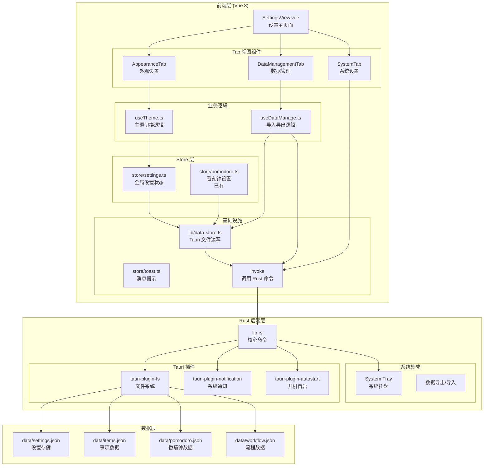

# 全局设置 — 架构设计文档

## 1. 整体架构图



---

## 2. 路由设计

无需新增路由，复用已有 `/settings` 路由。通过 **URL hash 参数** 切换 Tab：

| Tab | Hash | 说明 |
|-----|------|------|
| 外观 | `#appearance` | 主题模式选择 |
| 数据管理 | `#data` | 导出/导入/重置 |
| 系统 | `#system` | 开机自启、托盘行为 |

```typescript
// router/index.ts — 已有路由，无需修改
{
  path: "/settings",
  name: "settings",
  component: () => import("@/pages/SettingsView.vue"),
  meta: { title: "设置" },
}
```

---

## 3. 状态管理设计

### 3.1 新增 Store：`store/settings.ts`

```typescript
// 设置数据结构 (data/settings.json)
interface Settings {
  theme: "light" | "dark" | "system"   // 主题模式
  autostart: boolean                     // 开机自启
}
```

**核心方法：**
| 方法 | 说明 |
|------|------|
| `loadSettings()` | 应用启动时加载设置，写入 reactive state |
| `saveSettings()` | 每次修改后持久化到 `data/settings.json` |
| `applyTheme(theme)` | 切换主题：修改 `<html>` 的 `.dark` class |
| `watchSystemTheme()` | 跟随系统时监听 `prefers-color-scheme` 变化 |

**初始化流程：**
```
App.vue onMounted
  └→ loadSettings()
      ├→ dataStore.read("data/settings.json")
      ├→ 如果不存在 → 返回默认值
      ├→ 写入 reactive state
      └→ applyTheme(state.theme)
```

### 3.2 复用 Store

| Store | 复用内容 |
|-------|---------|
| `store/pomodoro.ts` | `focusMinutes`、`breakMinutes`、`totalRounds`（已有 `saveTimerSettings`） |
| `store/toast.ts` | 操作成功后提示用户 |

---

## 4. 组件树设计

```
SettingsView.vue  ← 整个页面
├── <左侧 Tab 导航>
│   ├── 🎨 外观
│   ├── 💾 数据管理
│   └── ⚙️ 系统
│
├── AppearanceTab.vue  ← 外观设置
│   └── ThemeSelector  ← 三个单选按钮
│       ├── ☀️ 浅色
│       ├── 🌙 深色
│       └── 💻 跟随系统
│
├── DataManagementTab.vue  ← 数据管理
│   ├── 导出区域
│   │   ├── 导出 JSON 按钮
│   │   └── 导出 CSV 按钮
│   ├── 导入区域
│   │   ├── 选择文件按钮
│   │   └── 导入按钮
│   └── 危险区域
│       └── 重置所有数据按钮
│           └── 二次确认弹窗（内联模态框）
│
└── SystemTab.vue  ← 系统设置（暂留，后续扩展）
```

**设计原则：**
- 功能型 Tab 页面作为独立组件存在，而非在 `SettingsView.vue` 中堆叠
- 主题选择器作为小组件内联在 `AppearanceTab.vue` 中，不抽离为独立组件（减少文件数）
- 二次确认弹窗复用项目已有的模态框模式（`Teleport to="body"` + `fixed inset-0`）

---

## 5. 接口契约定义

### 5.1 Rust 命令

| 命令 | 参数 | 返回值 | 说明 |
|------|------|--------|------|
| `export_data` | `format: "json" \| "csv"` | `Result<String, String>`（文件路径） | 将全部数据导出到文件 |
| `import_data` | `path: String` | `Result<(), String>` | 从文件导入数据（完全替换） |
| `reset_all_data` | — | `Result<(), String>` | 清空所有数据文件 |
| `set_autostart` | `enabled: bool` | `Result<(), String>` | 设置开机自启 |
| `send_native_notification` | `title, body: String` | `Result<(), String>` | 发送系统通知（已有） |
| `toggle_tray` | — | `Result<(), String>` | 最小化到托盘 |

### 5.2 前端 invoke 调用

```typescript
// 导出数据
const result = await invoke<string>("export_data", { format: "json" })

// 导入数据
await invoke("import_data", { path: filePath })

// 重置数据
await invoke("reset_all_data")

// 设置开机自启
await invoke("set_autostart", { enabled: true })
```

### 5.3 数据文件结构

**`data/settings.json`：**
```json
{
  "theme": "system",
  "autostart": false
}
```

---

## 6. 数据流图

### 6.1 主题切换流程

```
用户选择"深色模式"
  └→ SettingsTab 调用 useTheme().setTheme("dark")
      ├→ store/settings.ts 更新 theme = "dark"
      ├→ dataStore.write("data/settings.json", ...)  持久化
      └→ document.documentElement.classList.add("dark")  生效

跟随系统：
  └→ useTheme 监听 window.matchMedia("(prefers-color-scheme: dark)")
      ├→ 变化时自动切换 .dark class
      └→ 不修改 settings.json（保持 "system" 不变）
```

### 6.2 数据导出流程

```
用户点击"导出 JSON"
  └→ invoke("export_data", { format: "json" })
      ├→ Rust 端读取 items.json + pomodoro.json + workflow.json
      ├→ 合并为单一日志对象
      ├→ Tauri 原生对话框让用户选择保存路径
      └→ 写入文件 → 返回文件路径

用户点击"导出 CSV"
  └→ 同上，但先转 CSV 格式再写入
```

### 6.3 数据导入流程

```
用户点击"导入" → 选择文件
  └→ Tauri 原生对话框让用户选择文件
  └→ invoke("import_data", { path })
      ├→ Rust 端读取选中文件
      ├→ 校验 JSON 格式
      ├→ 清空 items.json + pomodoro.json + workflow.json
      ├→ 写入新数据
      └→ 前端重新加载所有数据
```

### 6.4 重置数据流程

```
用户点击"重置所有数据"
  └→ 弹出二次确认弹窗："确定要清空所有数据吗？此操作不可恢复。"
      ├→ 取消 → 关闭弹窗
      └→ 确认 → invoke("reset_all_data")
          ├→ 清空所有 data/*.json 文件
          ├→ 前端重新加载（所有列表为空）
          └→ Toast 提示"数据已重置"
```

---

## 7. 异常处理策略

| 场景 | 处理方式 |
|------|---------|
| 设置文件损坏 | `loadSettings` 时 try-catch，返回默认值，不阻塞应用启动 |
| 导出文件写入失败 | Rust 端返回 `Err`，前端 Toast 提示"导出失败，请检查磁盘空间" |
| 导入文件格式不正确 | Rust 端校验 JSON 合法性，非法格式返回明确错误信息 |
| 开机自启设置失败 | 静默处理，Toast 提示"设置失败" |
| 主题色系统偏好不可读 | 默认使用浅色模式，不退化为黑色/白色裸样式 |

---

## 8. 文件变更清单

### 新增文件

| 文件 | 用途 |
|------|------|
| `src/store/settings.ts` | 设置状态管理（主题、行为偏好） |
| `src/composables/useTheme.ts` | 主题切换逻辑（class 切换 + 系统偏好监听） |
| `src/components/settings/AppearanceTab.vue` | 外观设置 Tab 页 |
| `src/components/settings/DataManagementTab.vue` | 数据管理 Tab 页 |
| `src/components/settings/ConfirmDialog.vue` | 通用二次确认弹窗（供重置数据用） |

### 修改文件

| 文件 | 改动 |
|------|------|
| `src/pages/SettingsView.vue` | 重写为 Tab 导航 + 子组件组合布局 |
| `src/App.vue` | `onMounted` 中调用 `loadSettings()` 和主题初始化 |
| `src-tauri/src/lib.rs` | 新增 `export_data`、`import_data`、`reset_all_data`、`set_autostart` 命令 |
| `src-tauri/Cargo.toml` | 新增 `tauri-plugin-autostart` 依赖 |
| `src-tauri/capabilities/default.json` | 新增 autostart 权限、托盘权限 |

### 无需修改文件

| 文件 | 原因 |
|------|------|
| `src/router/index.ts` | 已有 `/settings` 路由，不改动 |
| `src/store/pomodoro.ts` | 番茄钟设置直接引用，不改动 |
| `src/store/items.ts` | 数据重置时只清内容，不改 store 逻辑 |

---

## 9. 架构决策记录

### ADR-001：设置使用独立 JSON 文件存储

- **决定**：设置数据独立存储为 `data/settings.json`
- **理由**：与业务数据（items、pomodoro、workflow）分离，避免设置修改触发业务数据备份/迁移
- **替代方案**：合并到 `items.json` —— 拒绝，因为与业务数据无关

### ADR-002：主题切换使用 CSS class 方案

- **决定**：通过 `document.documentElement.classList.toggle('dark')` 控制
- **理由**：项目已有完整的 `.dark` CSS 变量定义和 `dark:` 前缀的 Tailwind 类，不需要额外引入主题库
- **替代方案**：CSS 变量运行时替换 —— 拒绝，与现有代码风格不兼容

### ADR-003：导出使用 Rust 后端组合数据

- **决定**：Rust 端从多个 JSON 文件读取数据，合并后输出
- **理由**：数据分散在多个文件中，后端组合更可靠；前端只需调用一次 `invoke`
- **替代方案**：前端分别读取再组合 —— 拒绝，增加前端复杂度且多次 invoke 性能差

### ADR-004：Tab 导航使用 hash 而非状态管理

- **决定**：通过 URL hash（`#appearance`、`#data`、`#system`）切换 Tab
- **理由**：使 Tab 状态可分享/可链接，不需要额外状态管理；pure URL 方案最轻量
- **替代方案**：Vue reactive state —— 拒绝，hash 方案更简单且可 URL 定位