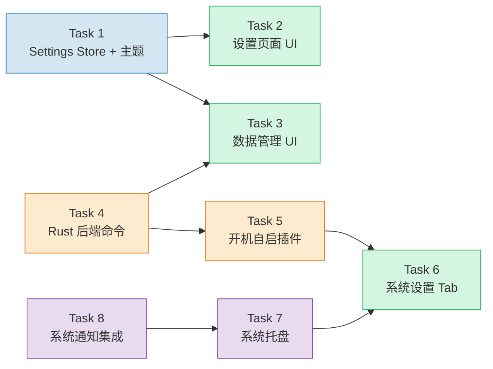
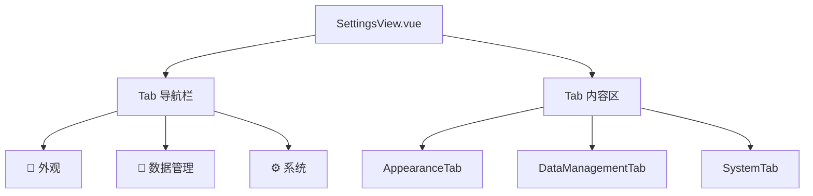

# 全局设置 — 原子任务拆分

## 任务依赖图



**并行策略：**

```
T1 ──→ T2          (前端 UI，可串行)
T4 ──→ T5          (Rust 后端，可并行)
T1 与 T4 互不依赖，可同时进行
T7 不依赖前端，可与 T1-T3 同时进行
T8 依赖 T7，但可等到最后
```

---

## Task 1：Settings Store + 主题切换

### 输入契约

- **前置依赖**：无
- **输入数据**：无
- **环境依赖**：`dataStore` 已存在（`src/lib/data-store.ts`），`.dark` CSS 变量已定义

### 实现内容

#### 1.1 创建 `src/store/settings.ts`

```typescript
// 新增文件
import { reactive } from "vue"
import { dataStore } from "@/lib/data-store"

const DATA_FILE = "data/settings.json"

interface SettingsState {
  theme: "light" | "dark" | "system"
  loaded: boolean
}

const state = reactive<SettingsState>({
  theme: "system",
  loaded: false,
})

export async function loadSettings() {
  if (state.loaded) return
  const data = await dataStore.read<any>(DATA_FILE)
  if (data?.theme) state.theme = data.theme
  state.loaded = true
  applyTheme(state.theme)
}

export async function saveSettings() {
  await dataStore.write(DATA_FILE, { theme: state.theme })
}

export function useSettings() {
  return { theme: computed(() => state.theme), loaded: computed(() => state.loaded) }
}
```

#### 1.2 创建 `src/composables/useTheme.ts`

```typescript
// 新增文件
export function applyTheme(theme: "light" | "dark" | "system") {
  const isDark = theme === "dark"
    || (theme === "system" && window.matchMedia("(prefers-color-scheme: dark)").matches)
  document.documentElement.classList.toggle("dark", isDark)
}

export function useTheme() {
  async function setTheme(theme: "light" | "dark" | "system") {
    state.theme = theme
    applyTheme(theme)
    await saveSettings()
  }

  // 跟随系统：监听系统主题变化
  let mediaQuery: MediaQueryList | null = null
  function startSystemThemeWatch() {
    mediaQuery = window.matchMedia("(prefers-color-scheme: dark)")
    const handler = () => {
      if (state.theme === "system") applyTheme("system")
    }
    mediaQuery.addEventListener("change", handler)
  }

  return { setTheme, startSystemThemeWatch }
}
```

#### 1.3 修改 `src/App.vue`

在 `onMounted` 中调用 `loadSettings()` 和 `startSystemThemeWatch()`

### 输出契约

- **交付物**：3 个文件（1 新增 store + 1 新增 composable + 1 修改 App.vue）
- **验收标准**：
  - [ ] 应用启动时加载 `data/settings.json`，不存在时使用默认值
  - [ ] 设置主题后 `.dark` class 正确切换
  - [ ] 跟随系统模式监听系统主题变化
  - [ ] 设置持久化到文件

---

## Task 2：设置页面 UI

### 输入契约

- **前置依赖**：Task 1（Settings Store + useTheme）
- **输入数据**：`useSettings()`、`useTheme()`
- **环境依赖**：`vue-router` 已安装，`/settings` 路由已存在

### 实现内容

#### 2.1 重写 `src/pages/SettingsView.vue`



- 顶部 Tab 导航栏，三个 Tab
- 通过 URL hash 切换 Tab（`#appearance`、`#data`、`#system`）
- 默认定位到 `#appearance`

#### 2.2 创建 `src/components/settings/AppearanceTab.vue`

- 三选一主题选择器：浅色 / 深色 / 跟随系统
- 每个选项带图标，点击后即时切换
- 调用 `useTheme().setTheme()`

### 输出契约

- **交付物**：2 个文件（1 修改 + 1 新增）
- **验收标准**：
  - [ ] 设置页显示 Tab 导航栏，三个 Tab 可切换
  - [ ] URL hash 随 Tab 切换变化
  - [ ] 直接访问 `/settings#data` 定位到对应 Tab
  - [ ] 外观 Tab 中三个主题选项点击后即时生效

---

## Task 3：数据管理 UI

### 输入契约

- **前置依赖**：Task 1（Settings Store） + Task 4（Rust 后端命令）
- **输入数据**：`invoke("export_data")`、`invoke("import_data")`、`invoke("reset_all_data")`
- **环境依赖**：已有 `@tauri-apps/plugin-dialog` 或 Tauri 原生对话框

### 实现内容

#### 3.1 创建 `src/components/settings/DataManagementTab.vue`

**导出区域：**
- "导出 JSON" 按钮 → 调用 `invoke("export_data", { format: "json" })`
- "导出 CSV" 按钮 → 调用 `invoke("export_data", { format: "csv" })`
- 导出成功后 Toast 提示

**导入区域：**
- "选择文件" 按钮 → Tauri 原生文件选择对话框
- 选择后显示文件名
- "导入" 按钮 → 确认后调用 `invoke("import_data")`
- 导入成功后重新加载所有数据 + Toast 提示

**危险区域（红色警告）：**
- "重置所有数据" 按钮 → 调用 `ConfirmDialog` 二次确认
- 确认后调用 `invoke("reset_all_data")` + 重新加载数据

#### 3.2 创建 `src/components/settings/ConfirmDialog.vue`

通用确认弹窗组件：
- 标题、描述、确认按钮、取消按钮
- 确认按钮可自定义样式（危险操作为红色）
- 使用 `Teleport to="body"` + `fixed` 定位

### 输出契约

- **交付物**：2 个新增文件
- **验收标准**：
  - [ ] 导出 JSON 按钮下载正确格式的文件
  - [ ] 导出 CSV 按钮下载正确格式的文件
  - [ ] 导入功能选择文件并完全替换数据
  - [ ] 重置数据弹出二次确认弹窗，确认后清空所有数据
  - [ ] 危险区域视觉上与其他区域区分

---

## Task 4：Rust 后端命令

### 输入契约

- **前置依赖**：无（与 Task 1-3 并行）
- **输入数据**：无
- **环境依赖**：`dataStore` 的文件结构（`data/items.json`、`data/pomodoro.json`、`data/workflow.json`）

### 实现内容

#### 4.1 修改 `src-tauri/src/lib.rs`

新增三个 Tauri 命令：

**`export_data(format: String) → Result<String, String>`**
- 读取所有 data/*.json 文件
- 合并为 `{ items: ..., pomodoro: ..., workflow: ..., settings: ..., exportedAt: ... }`
- format="json" → 直接序列化
- format="csv" → 将 items 数据转为 CSV（标题行 + 数据行）
- 使用 Tauri 对话框让用户选择保存路径（`tauri-plugin-dialog`）
- 写入文件，返回路径

**`import_data(path: String) → Result<(), String>`**
- 读取用户选择的文件
- 校验是否为有效的 Time-Master 导出格式
- 覆盖写入所有 data/*.json 文件

**`reset_all_data() → Result<(), String>`**
- 逐个清空所有 data/*.json 文件（写 `{}` 或初始结构）

### 4.2 安装 `tauri-plugin-dialog`（用于文件选择对话框）

- `Cargo.toml` 添加 `tauri-plugin-dialog`
- `lib.rs` 注册插件
- `capabilities/default.json` 添加权限
- 前端安装 `@tauri-apps/plugin-dialog`

### 输出契约

- **交付物**：修改 `lib.rs` + `Cargo.toml` + `capabilities/default.json`
- **验收标准**：
  - [ ] `export_data` 成功导出 JSON 格式文件
  - [ ] `export_data` 成功导出 CSV 格式文件
  - [ ] `import_data` 成功导入并替换数据
  - [ ] `reset_all_data` 清空所有数据文件
  - [ ] 文件选择对话框正常弹出

---

## Task 5：开机自启插件

### 输入契约

- **前置依赖**：Task 4（Rust 后端命令）
- **输入数据**：无
- **环境依赖**：Tauri v2

### 实现内容

#### 5.1 安装 `tauri-plugin-autostart`

- `Cargo.toml` 添加 `tauri-plugin-autostart`
- `lib.rs` 注册插件
- `capabilities/default.json` 添加 `"autostart:default"` 权限
- 前端安装 `@tauri-apps/plugin-autostart`

#### 5.2 新增 Rust 命令 `set_autostart(enabled: bool)`

```rust
#[tauri::command]
fn set_autostart(app: tauri::AppHandle, enabled: bool) -> Result<(), String> {
    use tauri_plugin_autostart::ManagerExt;
    let autostart = app.autostart();
    if enabled {
        autostart.enable().map_err(|e| e.to_string())?;
    } else {
        autostart.disable().map_err(|e| e.to_string())?;
    }
    Ok(())
}
```

### 输出契约

- **交付物**：修改 `Cargo.toml` + `lib.rs` + `capabilities/default.json`
- **验收标准**：
  - [ ] 调用 `set_autostart(true)` 后，系统启动时自动运行应用
  - [ ] 调用 `set_autostart(false)` 后，取消开机自启

---

## Task 6：系统设置 Tab

### 输入契约

- **前置依赖**：Task 5（开机自启插件）+ Task 7（系统托盘）
- **输入数据**：`invoke("set_autostart")`
- **环境依赖**：无

### 实现内容

#### 创建 `src/components/settings/SystemTab.vue`

- **开机自启**：开关切换按钮 → 调用 `invoke("set_autostart", { enabled })`
- **系统托盘说明**：静态文本说明关闭按钮行为
- 预留未来扩展位

### 输出契约

- **交付物**：1 个新增文件
- **验收标准**：
  - [ ] 开关开启后，下次开机自启
  - [ ] 开关关闭后，取消自启
  - [ ] 开关状态与系统实际状态一致

---

## Task 7：系统托盘

### 输入契约

- **前置依赖**：无（与 Task 1-6 并行）
- **输入数据**：无
- **环境依赖**：Tauri v2 内置托盘 API

### 实现内容

#### 7.1 修改 `src-tauri/src/lib.rs`

在 `setup` 回调中配置系统托盘：

```rust
use tauri::tray::{TrayIconBuilder, MenuEvent};
use tauri::menu::{MenuBuilder, MenuItemBuilder};

.setup(|app| {
    let show_item = MenuItemBuilder::with_id("show", "显示主窗口").build(app)?;
    let quit_item = MenuItemBuilder::with_id("quit", "退出应用").build(app)?;
    let menu = MenuBuilder::new(app)
        .item(&show_item)
        .item(&quit_item)
        .build()?;

    TrayIconBuilder::new()
        .icon(app.default_window_icon().unwrap().clone())
        .menu(&menu)
        .tooltip("时间管理")
        .on_menu_event(|app, event| match event.id.as_ref() {
            "show" => { /* 显示主窗口 */ }
            "quit" => { app.exit(0) }
            _ => {}
        })
        .build(app)?;

    Ok(())
})
```

#### 7.2 修改窗口关闭行为

在 `tauri.conf.json` 中配置 `closable: false` + 监听窗口关闭事件改为隐藏而非关闭，或通过 `on_window_event` 拦截：

```rust
.on_window_event(|window, event| {
    if let tauri::WindowEvent::CloseRequested { api, .. } = event {
        api.prevent_close();
        window.hide().unwrap();
    }
})
```

### 输出契约

- **交付物**：修改 `lib.rs` + `tauri.conf.json`（可能有）
- **验收标准**：
  - [ ] 应用启动后，系统托盘区域显示图标（使用现有 icon.ico）
  - [ ] 右键点击托盘图标，显示"显示主窗口"和"退出应用"两个菜单项
  - [ ] 点击"显示主窗口" → 窗口恢复显示
  - [ ] 点击"退出应用" → 应用完全退出
  - [ ] 点击窗口关闭按钮（X）→ 最小化到托盘，不退出
  - [ ] 左键点击托盘图标 → 显示主窗口

---

## Task 8：系统通知集成

### 输入契约

- **前置依赖**：Task 7（系统托盘，提供应用后台运行能力）
- **输入数据**：`invoke("send_native_notification")`
- **环境依赖**：`lib.rs` 中已有 `send_native_notification` 命令

### 实现内容

#### 修改 `src/composables/usePomodoroTimer.ts`

在 `playBeep()` 调用处增加系统通知：

```typescript
// 每轮切换时（focus → break 或 break → focus）
if (timerPhase.value === "focus") {
  // 切换到休息 → 通知
  sendNativeNotification("切换到休息时间", `第 ${currentRound.value} 轮专注完成`)
} else if (timerPhase.value === "break") {
  // 切换到专注 → 通知
  sendNativeNotification("切换到专注时间", "休息结束，开始下一轮专注")
}

// 全部轮次完成时
if (currentRound.value >= totalRounds.value && timerPhase.value === "ready") {
  sendNativeNotification("🎉 所有番茄钟完成", "恭喜！你已经完成了所有轮次！")
}
```

封装通知函数：

```typescript
import { invoke } from "@tauri-apps/api/core"

async function sendNativeNotification(title: string, body: string) {
  try {
    await invoke("send_native_notification", { title, body })
  } catch {
    // 静默处理，通知失败不阻塞计时器
  }
}
```

### 输出契约

- **交付物**：修改 `usePomodoroTimer.ts`
- **验收标准**：
  - [ ] 每轮番茄钟切换时弹出系统通知
  - [ ] 全部轮次完成时弹出系统通知
  - [ ] 通知不阻塞计时器正常运行
  - [ ] 通知失败时不影响其他功能

---

## 任务执行顺序建议

```
第一阶段（并行）：
  ├── Task 1: Settings Store + 主题
  ├── Task 4: Rust 后端命令
  └── Task 7: 系统托盘

第二阶段（Task 1 完成后）：
  └── Task 2: 设置页面 UI

第三阶段（Task 4 完成后）：
  ├── Task 3: 数据管理 UI
  └── Task 5: 开机自启插件

第四阶段（Task 5 + Task 7 完成后）：
  └── Task 6: 系统设置 Tab

第五阶段（Task 7 完成后）：
  └── Task 8: 系统通知集成
```